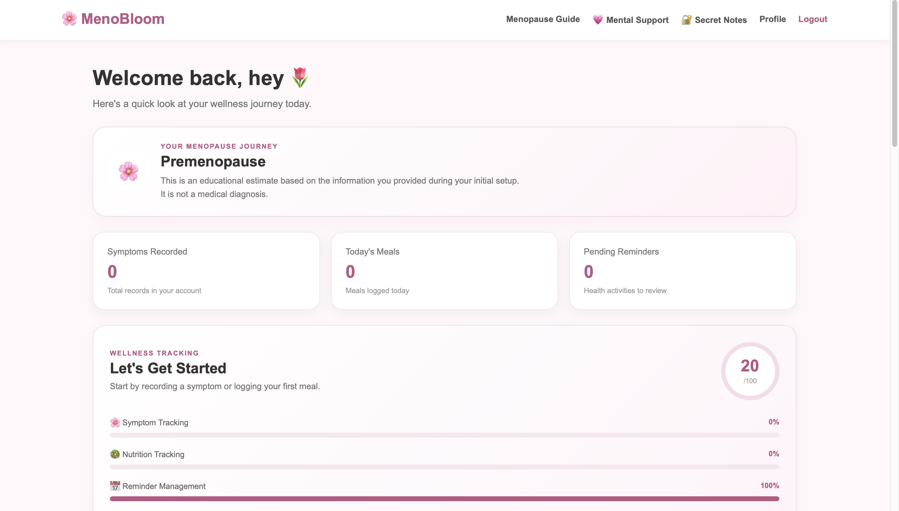
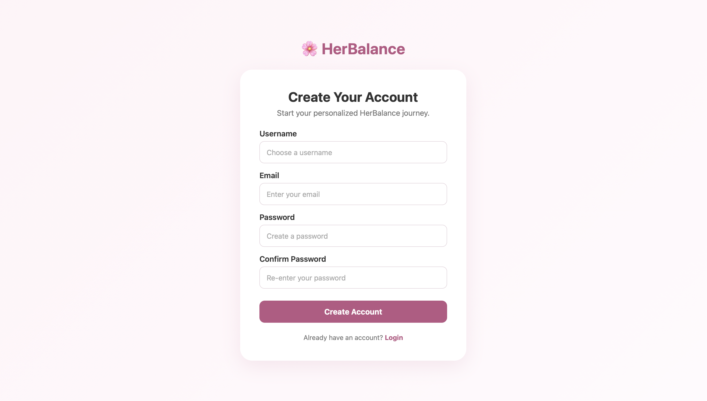
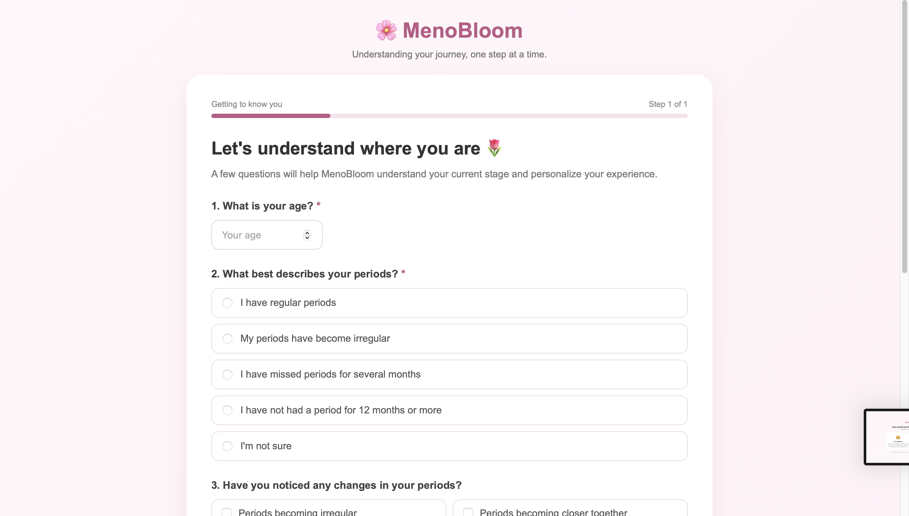

# 🌸 MenoBloom

### A Digital Menopause Wellness & Support Platform

MenoBloom is a web-based wellness platform designed to help women navigate menopause through personalized symptom tracking, nutrition management, health reminders, private reflection, and supportive family connections.

The platform focuses on making menopause care more organized, personal, and supportive while keeping the woman's privacy and control at the center.

---

## 🌐 Live Demo

🚀 **MenoBloom is live and accessible online.**

👉 Visit the live application from the project repository's deployment link.

---

## 💡 Problem Statement

Menopause is a major stage of life, but many women face difficulties in:

- Understanding recurring symptoms
- Tracking symptom patterns over time
- Maintaining healthy nutrition
- Remembering important health appointments
- Expressing emotional and mental concerns
- Getting meaningful support from family members
- Keeping sensitive personal thoughts private
- Organizing all of this information in one place

At the same time, family members may want to support someone going through menopause without unintentionally invading their privacy.

MenoBloom addresses these challenges through a single, privacy-conscious digital platform.

---

# 🌸 Our Solution

MenoBloom provides a centralized wellness platform where users can:

📊 Track symptoms  
📈 Analyze symptom patterns  
🥗 Monitor nutrition  
🔔 Manage health reminders  
👨‍👩‍👧 Connect trusted family members  
💗 Access mental and emotional support  
🔒 Maintain private personal notes  
👩‍⚕️ Access doctor-related support and information  

The goal is simple:

> **Support women through menopause without taking control away from them.**

---

# ✨ Key Features

## 1. 👩 Personalized Woman's Dashboard

The dashboard provides a quick overview of the user's wellness journey.

It includes:

- Menopause stage
- Symptoms recorded
- Meals tracked
- Pending reminders
- Wellness tracking overview
- Personalized information

---

## 2. 🌸 Symptom Tracking

Users can record symptoms such as:

- Hot flashes
- Night sweats
- Sleep problems
- Mood changes
- Anxiety
- Fatigue
- Headaches
- Joint/muscle discomfort
- Brain fog
- Vaginal dryness
- Urinary changes

Each symptom can include:

- Severity
- Frequency
- Date
- Personal notes

This allows users to build a personal history of their symptoms.

---

## 3. 📊 Symptom Analysis

MenoBloom transforms recorded symptom information into visual insights.

The analysis page provides:

- Symptom frequency over time
- Symptom breakdown
- Recent symptom entries
- Visual graphs
- Tracking insights

The graph updates using the user's actual recorded symptom data.

> **Note:** The analysis is intended for wellness tracking and is not a medical diagnosis.

---

## 4. 🥗 Nutrition Tracking

Users can record their meals and monitor nutritional information including:

- Calories
- Protein
- Calcium
- Carbohydrates
- Fat
- Fiber

The platform also stores health and menopause-related benefits associated with meals.

This helps users become more aware of their nutritional habits during menopause.

---

## 5. 🔔 Health Reminders

Users can create reminders for important health activities.

Examples include:

- Cancer screening
- Cervical cancer screening
- Bone health
- Routine health checks
- Medication
- Doctor appointments
- Follow-ups
- Custom reminders

Users can mark reminders as completed and keep track of upcoming tasks.

---

## 6. 👨‍👩‍👧 Family Support & Account Connection

MenoBloom allows a woman to connect with a trusted family member.

The connection system uses a unique connection code.

The woman remains in control of what information is shared.

Possible shared categories include:

- 🌸 Symptoms
- 🥗 Nutrition
- 🔔 Reminders

Family members do not automatically receive private health information simply because their accounts are connected.

### Design principle:

> **Support, don't take over.**

---

## 7. 💗 Mental & Emotional Support

MenoBloom includes a dedicated mental-support area designed to provide a safe space for users to express what they are feeling.

The feature is intended to provide supportive conversation and emotional encouragement.

It is not intended to replace professional mental-health care.

---

## 8. 🔒 Secret Notes

Users can maintain private personal notes where they can write down:

- How they are feeling
- Personal thoughts
- Difficult experiences
- Emotional reflections
- Things they may want to remember
- Private wellness observations

These notes are separate from family-sharing functionality.

---

## 9. 👩‍⚕️ Doctor Support

MenoBloom also provides a dedicated area for doctor-related guidance and support.

This helps users organize their health journey and encourages appropriate professional consultation when needed.

---

# 🖥️ Screenshots

## 🏠 Homepage



---

## 🔐 Login



---

## 📝 Signup



---

## 👩 Woman Dashboard


---

## 🌸 Symptom Tracking


---

## 📊 Analysis


The analysis dashboard visualizes recorded symptoms and helps users identify patterns over time.

---

## 🥗 Nutrition


---

## 🔔 Reminders


---

## 👨‍👩‍👧 Family Support


---

## 🔗 Connected Family Account


---

## 👩‍⚕️ Doctor Help


---

# 🏗️ System Architecture

MenoBloom follows a Django-based web application architecture.

```text
                         ┌─────────────────────┐
                         │       User          │
                         └──────────┬──────────┘
                                    │
                                    ▼
                         ┌─────────────────────┐
                         │     MenoBloom       │
                         │    Web Interface    │
                         └──────────┬──────────┘
                                    │
                                    ▼
                         ┌─────────────────────┐
                         │       Django        │
                         │   Backend / Views   │
                         └──────────┬──────────┘
                                    │
              ┌─────────────────────┼─────────────────────┐
              │                     │                     │
              ▼                     ▼                     ▼
       ┌─────────────┐       ┌─────────────┐       ┌─────────────┐
       │   Symptoms  │       │  Nutrition  │       │  Reminders  │
       └─────────────┘       └─────────────┘       └─────────────┘
              │                     │                     │
              └─────────────────────┼─────────────────────┘
                                    │
                                    ▼
                         ┌─────────────────────┐
                         │     User Data       │
                         │    & Profiles       │
                         └──────────┬──────────┘
                                    │
                   ┌────────────────┴────────────────┐
                   │                                 │
                   ▼                                 ▼
          ┌─────────────────┐              ┌─────────────────┐
          │ Family Support  │              │ Private Notes   │
          └─────────────────┘              └─────────────────┘
