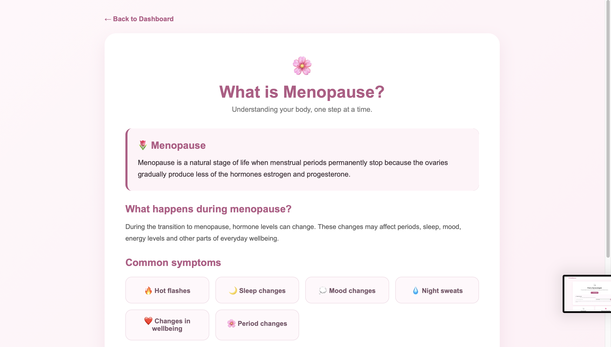
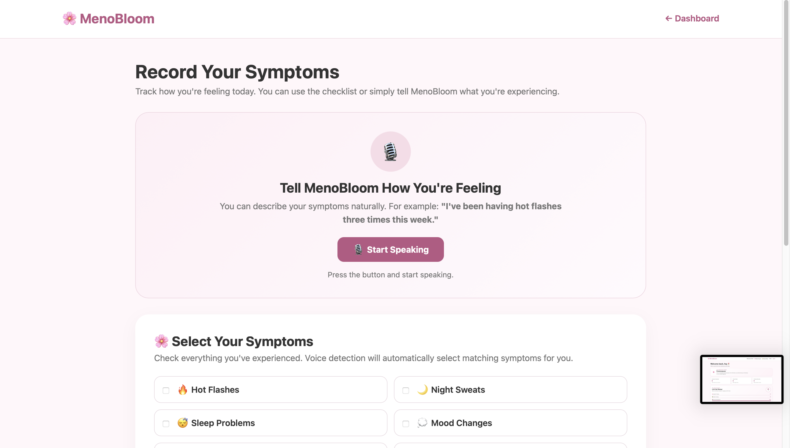
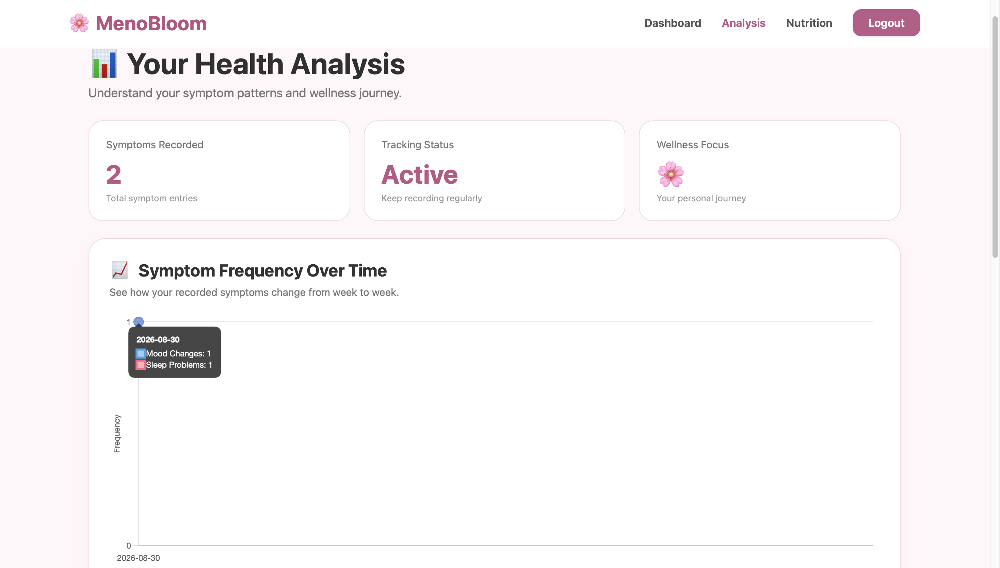
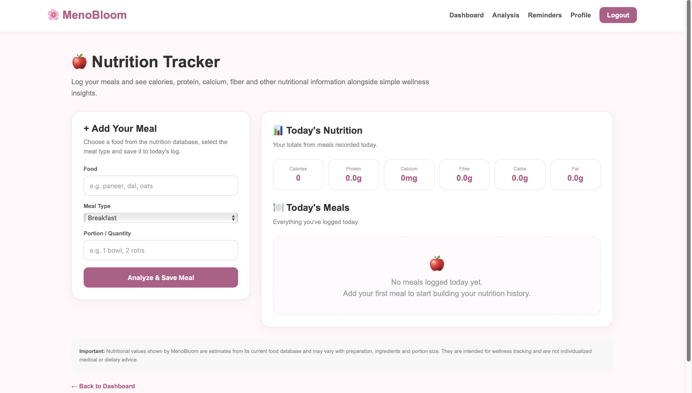
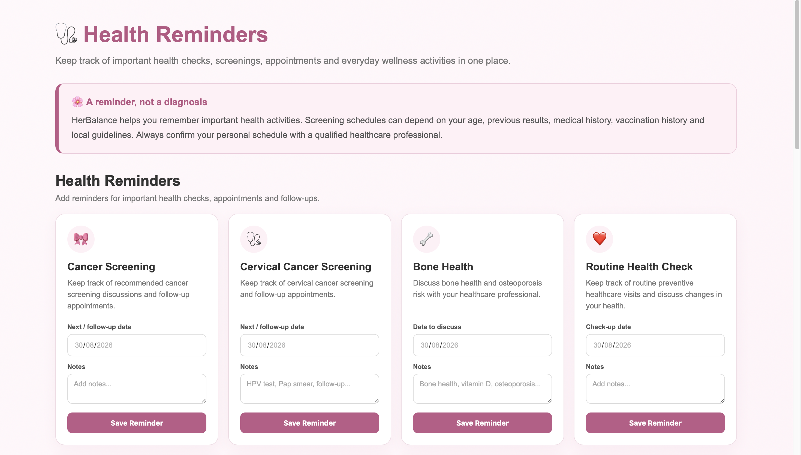
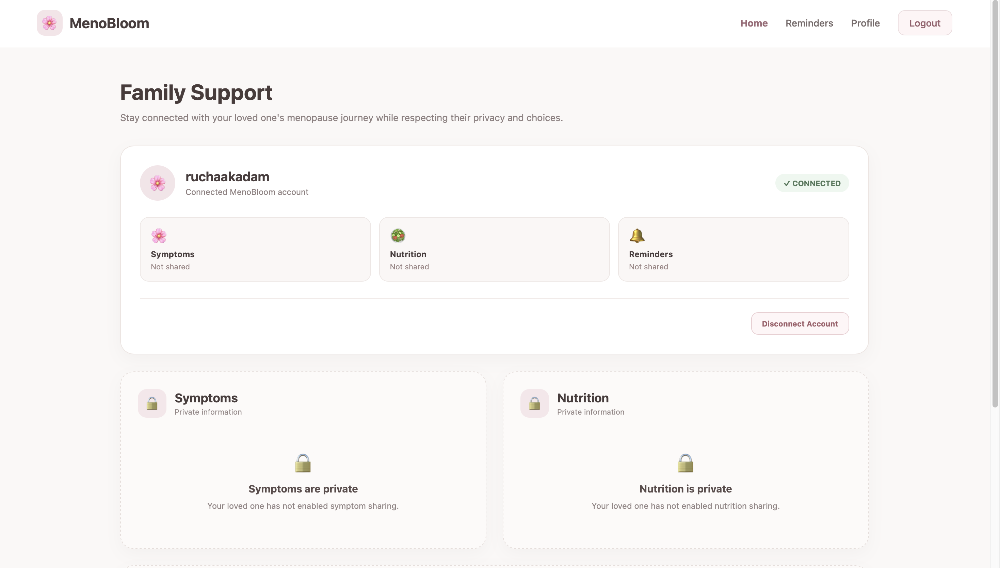
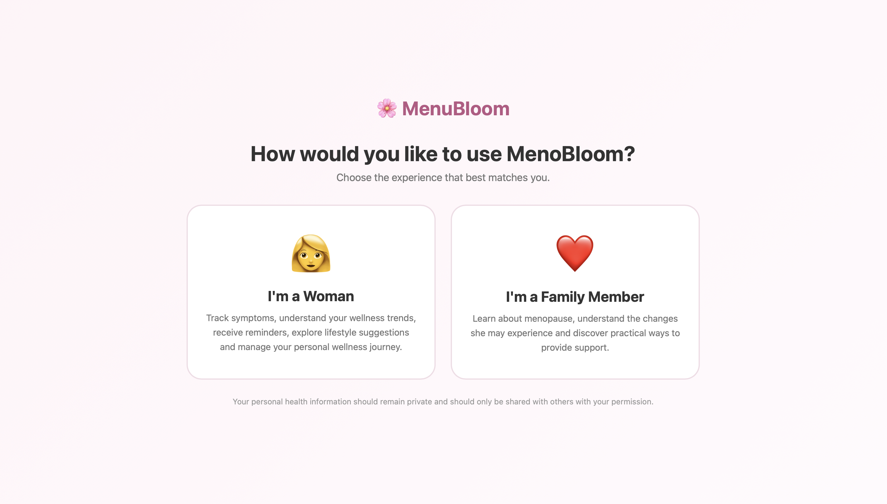
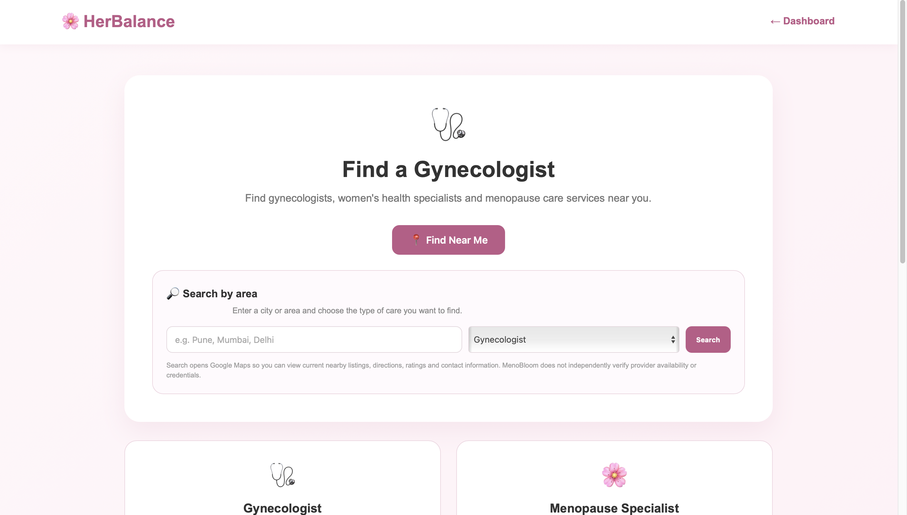

# 🌸 MenoBloom

### A Digital Menopause Wellness & Support Platform

MenoBloom is a web-based wellness platform designed to help women navigate menopause through personalized symptom tracking, nutrition management, health reminders, mental support, private reflection, and trusted family connections.

The platform brings multiple aspects of menopause wellness into one centralized and user-friendly experience while keeping privacy and user control at the center.

---

## 🌐 Live Demo

### 🚀 Try MenoBloom Online

👉 **https://menobloom-55tf.onrender.com**

MenoBloom is deployed as a live Django web application using Render.

---

# 💡 Problem Statement

Menopause is an important stage of life, yet many women face difficulties managing the physical, emotional, and lifestyle changes associated with it.

Common challenges include:

- Tracking recurring symptoms
- Understanding symptom patterns
- Maintaining healthy nutrition
- Remembering important health activities
- Expressing emotional concerns
- Finding supportive resources
- Communicating with family members
- Keeping sensitive personal thoughts private

At the same time, family members may want to provide support without invading the woman's privacy.

MenoBloom was designed to address these challenges through a single digital platform.

---

# 🌸 Our Solution

MenoBloom combines wellness tracking, organization, emotional support, and controlled family connection into one platform.

Users can:

🌸 Track symptoms  
📊 Analyze symptom patterns  
🥗 Track meals and nutrition  
🔔 Manage health reminders  
👨‍👩‍👧 Connect with trusted family members  
💗 Access mental and emotional support  
🔒 Write private personal notes  
👩‍⚕️ Access doctor-related support  

### Our core principle:

> **Support, don't take over.**

The woman remains in control of her personal information and decides what is shared with connected family members.

---

# ✨ Key Features

## 🌸 1. Personalized Dashboard

The MenoBloom dashboard provides a quick overview of the user's wellness journey.

It displays:

- Menopause stage
- Symptoms recorded
- Meals tracked
- Pending reminders
- Wellness tracking progress
- Personalized information



---

# 🌸 2. Symptom Tracking

Users can record and monitor symptoms associated with menopause.

Supported symptoms include:

- Hot Flashes
- Night Sweats
- Sleep Problems
- Mood Changes
- Anxiety
- Fatigue
- Headache
- Joint/Muscle Discomfort
- Brain Fog
- Vaginal Dryness
- Urinary Changes

Each entry can contain:

- Symptom
- Severity
- Frequency
- Date
- Notes



---

# 📊 3. Symptom Analysis

MenoBloom converts recorded symptom information into visual insights.

The analysis section provides:

- Symptom trends
- Symptom frequency
- Symptom breakdown
- Recent symptom entries
- Visual graphs

This helps users understand their personal tracking patterns over time.



> **Disclaimer:** MenoBloom's analysis is intended for wellness tracking and educational purposes. It is not a medical diagnosis.

---

# 🥗 4. Nutrition Tracking

Users can record their meals and monitor nutritional information.

The platform tracks:

- Calories
- Protein
- Calcium
- Carbohydrates
- Fat
- Fiber

It also provides stored information about:

- Health benefits
- Menopause-related benefits
- Food-related wellness insights



---

# 🔔 5. Health Reminders

MenoBloom helps users keep track of important health activities.

Reminder categories include:

- Cancer Screening
- Cervical Cancer Screening
- Bone Health
- Routine Health Check
- Medication
- Doctor Appointment
- Follow-up
- Custom Reminder

Users can:

- Create reminders
- Add due dates
- Add notes
- Mark reminders as completed
- View upcoming reminders



---

# 👨‍👩‍👧 6. Family Support

MenoBloom allows women to connect with trusted family members.

A woman can generate a unique connection code and share it with someone she trusts.

The family member can then use the code to request a connection.



---

# 🔗 7. Controlled Family Sharing

After accounts are connected, the woman controls what information is shared.

Possible sharing categories include:

- 🌸 Symptoms
- 🥗 Nutrition
- 🔔 Reminders

Information is not automatically exposed simply because two accounts are connected.



### Privacy principle

> **Connected does not mean unrestricted access.**

---

# 💗 8. Mental & Emotional Support

MenoBloom includes a dedicated mental-support section where users can express what they are feeling and receive supportive conversational guidance.

The feature is designed to provide:

- Emotional support
- A space to express feelings
- Encouragement
- Supportive conversation
- A private place to reflect

It is designed as a wellness-support feature and does not replace professional mental-health care.

---

# 🔒 9. Secret Notes

MenoBloom provides a private notes section where users can write down things they may not want to share with anyone else.

Users can write about:

- Personal feelings
- Emotional experiences
- Difficult days
- Private thoughts
- Personal reflections
- Wellness observations

These notes are kept separate from the family-sharing system.

---

# 👩‍⚕️ 10. Doctor Support

MenoBloom also provides a doctor-support section to help users access useful health-related guidance and encourage appropriate professional consultation.



---

# 🔐 Privacy by Design

Privacy is a core principle of MenoBloom.

The platform is designed so that:

- Personal information remains associated with the user's account.
- Family members do not automatically receive private information.
- Sharing is controlled by the woman.
- Private notes are separate from shared information.
- Family connections require a connection code.
- Connected accounts only receive information that has been explicitly shared.

This allows family members to provide meaningful support without removing the woman's control over her information.

---

# 🏗️ System Architecture

```text
                         ┌───────────────────┐
                         │       USER        │
                         └─────────┬─────────┘
                                   │
                                   ▼
                         ┌───────────────────┐
                         │     MenoBloom     │
                         │    Web Interface  │
                         └─────────┬─────────┘
                                   │
                                   ▼
                         ┌───────────────────┐
                         │      Django       │
                         │ Backend / Views   │
                         └─────────┬─────────┘
                                   │
              ┌────────────────────┼────────────────────┐
              │                    │                    │
              ▼                    ▼                    ▼
       ┌──────────────┐     ┌──────────────┐     ┌──────────────┐
       │   Symptoms   │     │  Nutrition   │     │  Reminders   │
       └──────────────┘     └──────────────┘     └──────────────┘
              │                    │                    │
              └────────────────────┼────────────────────┘
                                   │
                                   ▼
                         ┌───────────────────┐
                         │   User Profile    │
                         └─────────┬─────────┘
                                   │
                    ┌──────────────┴──────────────┐
                    │                             │
                    ▼                             ▼
           ┌─────────────────┐          ┌─────────────────┐
           │ Family Support  │          │  Private Notes  │
           └─────────────────┘          └─────────────────┘
